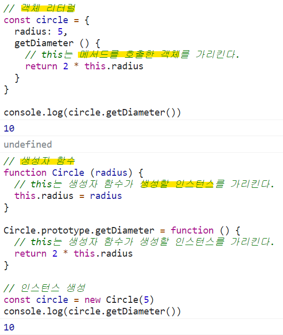

# this 키워드
객체는 상태(state)를 나타내는 프로퍼티와 동작(behavior)을 나타내는 메서드를 하나의 논리적인 단위로 묵은 복합적인 자료구조다.  
동작을 나타내는 **메서드는 자신이 속한 객체의 상태, 즉 프로퍼티를 참조하고 변경**할 수 있어야 한다. 이때 메서드가 자신이 속한 객체의 프로퍼티를 참조하려면 먼저 **자신이 속한 객체를 가리키는 식별자를 재귀적으로 참조**할 수 있다.  
### 객체 리터럴 방식으로 생성한 객체 
객체 리터럴 방식으로 생성한 객체의 경우 메서드 내부에서 메서드 자신이 속한 객체를 가리키는 식별자를 재귀적으로 참조할 수 있다.  
```js
const circle = {
  // 프로퍼티: 객체 고유의 상태 데이터
  radius: 5,
  // 메서드: 상태 데이터를 참조하고 조작하는 동작
  getDiameter () {
    // 이 메서드가 자신이 속한 객체의 프로퍼티나 다른 메서드를 참조하려면
    // 자신이 속한 객체인 circle을 참조할 수 있어야 한다.
    return 2 * circle.radius
  }
}

console.log(circle.getDiameter())  // 10
```
getDiameter 메서드 내에서 메서드 자신이 속한 객체를 가리키는 식별자 circle을 참조하고 있다. 이 참조 표현식이 평가되는 시점은 getDiameter 메서드가 호출되어 함수 몸체가 실행되는 시점이다.  
위 예제의 객체 리터럴은 circle 변수에 할당되기 직전에 평가된다. 따라서 getDiameter 메서드가 호출되는 시점에는 이미 객체 리터럴의 평가가 완료되어 객체가 생성되었고, circle 식별자에 생성된 객체가 할당된 이후다. 따라서 메서드 내부에서 circle 식별자를 참조할 수 있다.  
### 생성자 함수 방식으로 생성한 객체
```js
function Circle (radius) {
  // 이 시점에는 생성자 함수 자신이 생성할 인스턴스를 가리키는 식별자를 알 수 없다.
  ????.radius = radius
}

Circle.prototype.getDiameter = function () {
  // 이 시점에는 생성자 함수 자신이 생성할 인스턴스를 가리키는 식별자를 알 수 없다.
  return 2 * ????.radius
}

// 생성자 함수로 인스턴스를 생성하려면 먼저 생성자 함수를 정의해야 한다.
const circle = new Circle(5)
```
생성자 함수 내부에서는 프로퍼티 또는 메서드를 추가하기 위해 자신이 생성할 인스턴스를 참조할 수 있어야한다.  
하지만 생성자 함수에 의한 객체 생성 방식은 먼저 생성자 함수를 정의한 이후 new 연산자와 함꼐 생성자 함수를 호출하는 단계가 추가로 필요하다. 다시 말해, 생성자 함수로 인스턴스를 생성하려면 먼저 생성자 함수가 존재해야 한다.  
생성자 함수를 정의하는 시점에는 아직 인스턴스를 생성하기 이전이므로 생성자 함수가 생성할 인스턴스를 가리키는 식별자를 알 수 없다. 따라서 자신이 속한 객체 또는 자신이 생성할 인스턴스를 가리키는 특수한 식별자가 필요하다. 이를 위해 자바스크립트는 this라는 특수한 식별자를 제공한다.  
this는 자신이 속한 객체 또는 자신이 생성할 인스턴스를 가리키는 **자기 참조 변수(self-referencing variable)** 다. this를 통해 자신이 속한 객체 또는 자신이 생성할 인스턴스의 프로퍼티나 메서드를 참조할 수 있다.  
this는 자바스크립트 엔진에 의해 암묵적으로 생성되며, 코드 어디서든 참조할 수 있다. **함수를 호출하면 arguments 객체와 this가 암묵적으로 함수 내부에 전달**된다. 함수 내부에서 arguments 객체를 지역 변수처럼 사용할 수 있는 것처럼 this도 지역 변수처럼 사용할 수 있다. 단, this가 가리키는 값, 즉 **this 바인딩은 함수 호출 방식에 의해 동적으로 결정**된다.  
> this 바인딩(binding)  
> 바인딩이랑 식별자와 값을 연결하는 과정이다. 예를 들어 변수 선언은 변수 이름(식별자)과 확보된 메모리 공간의 주소를 바인딩하는 것이다.  
> this 바인딩은 this(키워드로 분류되지만 식별자 역할을 한다)와 this가 가리킬 객체를 바인딩하는 것이다.  
  
  

자바나 C++ 같은 클래스 기반 언어에서 this는 언제나 클래스가 생성하는 인스턴스를 가리킨다. 하지만 **자바스크립트의 this는 함수가 호출되는 방식에 따라 this에 바인딩될 값, 즉 this 바인딩이 동적으로 결정**된다.  
this는 코드 어디에서든 참조 가능하다. 전역에서도 함수 내부에서도 참조할 수 있다.  

<342 ~ 345쪽>