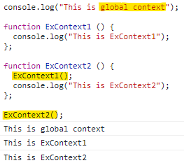

# 실행 컨텍스트 개념
**콜 스택(call stack)은 함수를 호출 할 때 해당 함수의 호출 정보(C 언어로 예를 들면, 함수 내 지역 변수 혹은 인자값 등)가 차곡차곡 쌓여있는 스택**을 의미한다.  
가령 C 언어의 경우는 함수가 호출될 때마다 해당 함수의 호출 정보가 기존 함수의 호출 정보 위에 스택 형태로 하나씩 쌓인다.  
개발자는 이러한 콜 스택의 호출 정보 등으로 **코드의 실행 과정을 추적하여 디버깅**을 수행한다. 이는 보통의 고급 프로그래밍 언어에서 흔히 사용하는 방식이고, 자바스크립트 역시 이 범주를 크게 벗어나지 않는다.  

실행 컨텍스트는 콜 스택에 들어가는 실행 정보 하나와 비슷하다. ECMAScript에서는 실행 컨텍스트를 "**실행 가능한 코드를 형상화하고 구분하는 추상적인 개념**"으로 기술한다.  
이를 콜 스택과 연관하여 정의하면, "**실행 가능한 자바스크립트 코드 블록이 실행되는 환경**"이라고 할 수 있고, 이 컨텍스트 안에 실행에 필요한 여러 가지 정보를 담고 있다.  
**실행 가능한 코드 블록은 대부분의 경우 함수**가 된다.  

실행 컨텍스트가 형성되는 경우(ECMAScript 규정)
* 전역 코드
* eval() 함수로 실행되는 코드
* 함수 안의 코드를 실행할 경우  

대부분 프로그래머는 함수로 실행 컨텍스트를 만든다. 그리고 이 코드 블록 안에 변수 및 객체, 실행 가능한 코드가 들어있다.  
이 코드가 실행되면 실행 컨텍스트가 생성되고, 실행 컨텍스트는 스택 안에 하나씩 차곡차곡 쌓이고, 제일 위(top)에 위치하는 실행 컨텍스트가 현재 실행되고 있는 컨텍스트다.  

  

전역 실행 컨텍스트가 가장 먼저 실행된다. 이 과정에서 새로운 함수 호출이 발생하면 새로운 컨텍스트가 만들어지고 실행되며, 종료되면 반환된다.  
이와 같은 과정이 반복된 후, 전역 실행 컨텍스트의 실행이 완료되면 모든 실행이 끝난다.  

ECMAScript에서는 실행 컨텍스트의 생성을 다음처럼 설명한다.

> 현재 실행되는 컨텍스트에서 이 컨텍스트와 관련 없는 실행 코드가 실행되면, 새로운 컨텍스트가 생성되어 스택에 들어가고 제어권이 그 컨텍스트로 이동한다. 

# 실행 컨텍스트 생성 과정  
```js
function execute(param1, param2) {
  var a = 1, b = 2;
  function func () {
    return a + b;
  }
  return param1 + param2 + func();
}

execute(3, 4);  // 10
```
## 1. 활성 객체 생성  
실행 컨텍스트가 생성되면 자바스크립트 엔진은 **해당 컨텍스트에서 실행에 필요한 여러 가지 정보를 담을 객체**를 생성하는데, 이를 활성 객체라고 한다.  
이 객체에 앞으로 사용하게 될 매개변수나 사용자가 정의한 변수 및 객체를 저장하고, 새로 만들어진 컨텍스트로 접근 가능하게 되어 있다. 이는 엔진 내부에서 접근할 수 있다는 것이지 사용자가 접근할 수 있다는 것은 아니다.  

## 2. arguments 객체 생성  
다음 단계에서는 arguments 객체를 생성한다. 앞서 만들어진 활성 객체는 arguments 프로퍼티로 이 arguments 프로퍼티로 이 arguments 객체를 참조한다.  

## 3. 스코프 정보 생성  
현재 컨텍스트의 유효 범위를 나타내는 스코프 정보를 생성한다. 이 스코프 정보는 현재 실행 중인 실행 컨텍스트 안에서 연결 리스트와 유사한 형식으로 만들어 진다.  

현재 컨텍스트에서 특정 변수에 접근해야 할 경우, 이 리스트를 활용한다. 이 리스트로 현재 컨텍스트의 변수뿐 아니라, 상위 실행 컨텍스트의 변수도 접근이 가능하다. 이 리스트에서 찾지 못한 변수는 결국 정의되지 않은 변수에 접근하는 것으로 판단하여 에러를 검출한다.  
이 리스트를 **스코프 페인**이라고 하는데, [[scope]] 프로퍼티로 참조된다.  

현재 생성된 활성 객체가 스코프 체인의 제일 앞에 추가되며, execute() 함수의 인자나 지역 변수 등에 접근할 수 있다.  

## 4. 변수 생성  
현재 실행 컨텍스트 내부에서 사용되는 지역 변수의 생성이 이루어진다.  
ECMAScript에서는 생성되는 변수를 저장하는 변수 객체를 언급하는데, 실제적으로 앞서 생성된 활성 객체가 변수 객체로 사용된다.  

변수 객체 안에서 호출된 함수 인자는 각각의 프로퍼티가 만들어지고 그 값이 할당된다. 만약 값이 넘겨지지 않았다면 undefined가 할당된다.

## 5. this 바인딩  
마지막 단계에서는 this 키워드를 사용하는 값이 할당된다. 여기서 this가 참조하는 객체가 없으면 전역 객체를 참조한다.  

## 6. 코드 실행  
하나의 실행 컨텍스트가 생성되고, 변수 객체가 만들어진 후에, 코드에 있는 여러가지 표현식 실행이 이루어진다.  
이렇게 실행되면서 변수의 초기화 및 연산, 또 다른 함수 실행 등이 이루어진다.  

전역 실행 컨텍스트는 일반적인 실행 컨텍스트와는 약간 다른데, arguments 객체가 없으며, 전역 객체 하나만을 포함하는 스코프 체인이 있다.  
ECMAScript에서 언급된 바에 의하면 실행 컨텍스트가 형성되는 세 가지 중 하나로서 전역 코드가 있는데, 이 **전역 코드가 실행될 때 생성되는 컨텍스트가 전역 실행 컨텍스트**다.  

전역 실행 컨텍스트는 변수를 초기화하고 이것의 내부 함수는 일반적인 탑 레벨의 함수로 선언된다. 그리고 전역 실행 컨텍스트의 변수 객체가 전역 객체로 사용된다. 즉, 전역 실행 컨텍스트에서는 변수 객체가 곧 전역 객체다.  
따라서 전역적으로 선언된 함수와 변수가 전역 객체의 프로퍼티가 된다. 전역 실행 컨텍스트 역시, this를 전역 객체의 참조로 사용한다.

