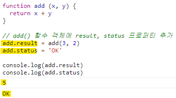
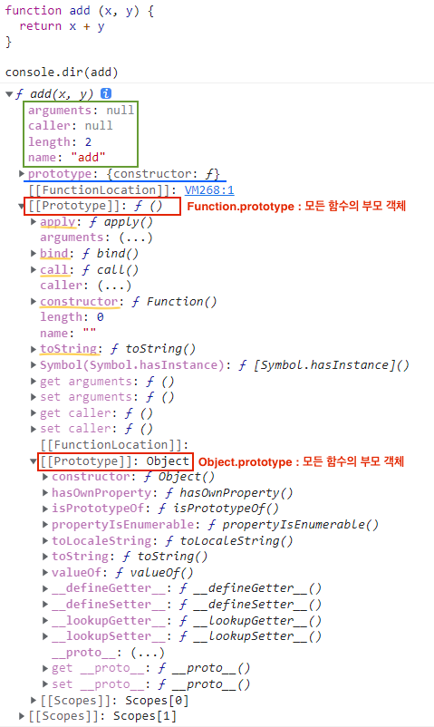
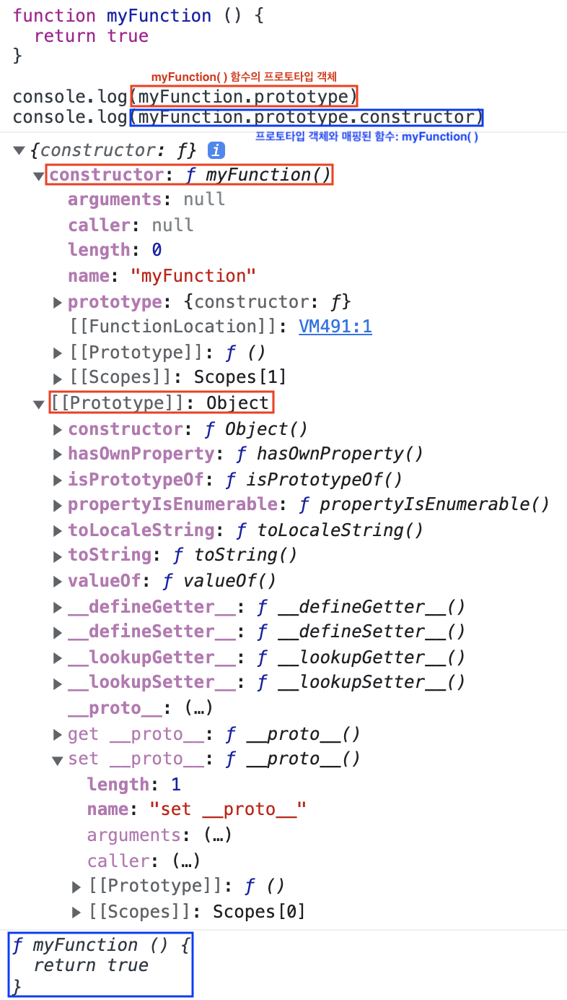
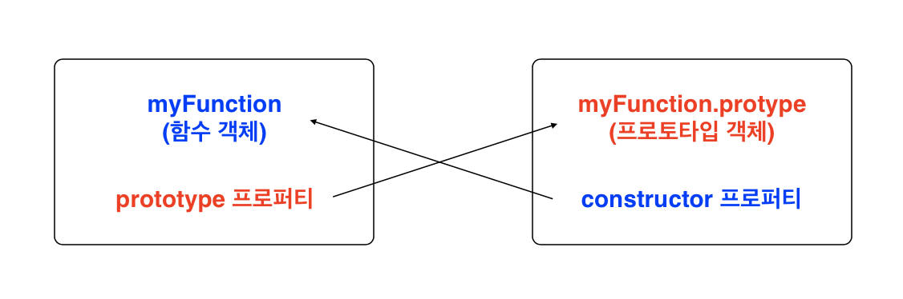

자바스크립트에서는 함수도 객체다.  
함수의 기본 기능인 코드 실행뿐만 아니라, 함수 자체가 일반 객체처럼 프로퍼티들을 가질 수 있다.  

  

일반 객체처럼 취급될 수 있는 함수는 다음과 같은 동작이 가능하다. 이와 같은 특징이 있는 함수를 **일급 객체**라고 부른다.

* 리터럴에 의해 생성
* 변수나 배열의 요소, 객체의 프로퍼티 등에 할당 가능
* 함수의 인수로 전달 가능
* 함수의 리턴값으로 리턴 가능
* 동적으로 프로퍼티를 생성 및 할당 가능  

<80 ~ 81쪽>  
# 함수 객체의 기본 프로퍼티
함수는 일반적인 객체의 기능에 추가로 **호출됐을 때 정의된 코드를 실행**하는 기능을 가지고 있다.  
또한 일반 객체와는 다르게 추가로 함수 객체만의 표준 프로퍼티가 정의되어 있다. 다음 예제 코드로 add() 함수 객체의 프로퍼티를 살펴보자.  

  

결과를 살펴보면 add() 함수는 arguments, caller, length 등과 같은 다양한 프로퍼티가 기본적으로 생성된 것을 확인할 수 있다. 이러한 프로퍼티들이 함수를 생성할 떄 포함되는 표준 프로퍼티다.  

* arguments 프로퍼티  
**함수를 호출할 떄 전달된 인자값**을 나타내는데 현재는 add() 함수가 호출된 상태가 아니므로 null 값이 출력됐다.  
* caller 프로퍼티  
**자신을 호출한 함수**를 나타낸다. 예제에서는 add() 함수를 호출하지 않았으므로 null 값이다.  
* length 프로퍼티: 함수를 작성할 때 정의한 **인자의 개수**를 나타낸다. 
* name 프로퍼티  
**함수의 이름**을 나타낸다. 익명함수라면 프로퍼티는 빈 문자열이 된다.
* [[Prototype]] 프로퍼티  
자신의 **부모 역할을 하는 프로토타입 객체**를 가리킨다. ECMA 표준에서는 add() 와 같이 함수 객체의 부모 역할을 하는 프로토타입 객체를 **Function.prototype 객체**라고 명명하고 있으며, 이것 역시 **함수 객체**라고 정의하고 있다.  
* prototype 프로퍼티  
함수가 생성될 때 만들어지며 constructor 프로퍼티 하나만 있는 객체를 가리킨다. 그리고 prototype 프로퍼티가 가리키는 프로토타입 객체의 유일한 constructor 프로퍼티는 자신과 연결된 함수를 가리킨다. 즉, 함수 객체와 프로토타입 객체는 각각 prototype과 constructor라는 프로퍼티로 서로를 참조하게 된다.

Function.prototype 객체의 프로토타입 객체는?

앞 설명에서 '모든 함수들의 부모 객체는 Function.prototype 객체'라고 했다. 그런데 ECMAScript 명세서에는 Function.prototype은 함수라고 정의하고 있다. 그렇다면 이러한 규칙에 의해 Function.prototype 함수 객체도 결국 함수이므로 자기 자신을 부모로 갖는 것인가? 라는 의문이 생기는 독자가 있을지도 모르겠다.  

ECMAScript 명세서에는 예외적으로 Function.prototype 함수 객체의 부모는 자바스크립트의 모든 객체의 조상격인 **Object.prototype 객체**라고 설명하고 있다.

prototype 프로퍼티와 [[Prototype]] 프로퍼티

두 프로퍼티 모두 **프로토타입 객체**를 가리킨다는 점에서는 공통점이 있지만, 관점에 차이가 있다.  
모든 객체에 있는 내부 프로퍼티인 [[Prototype]] 프로퍼티는 객체 입장에서 자신의 부모 역할을 하는 프로토타입 객체를 가리킨다.  
반면에 함수 객체가 가지는 prototype 프로퍼티는 이 함수가 생성자로 사용될 때 이 함수를 통해 생성된 객체의 부모 역할을 하는 프로토타입 객체를 가리킨다.  

  

함수 객체와 프로토타입 객체와의 관계
 

  

* myFunction() 함수가 생성되면서 함수의 prototype 프로퍼티에는 이 함수와 연결된 프로토타입 객체가 생성된다.
* myfunction.prototype은 myFunction() 함수의 프로토타입 객체를 의미한다.
* myFunction() 함수의 프로토타입 객체에는 constructor 프로퍼티와 [[Prototype]] 프로퍼티가 있다. 전자는 함수의 프로토타입 객체이므로 있는 것이고, 후자는 프로토타입 객체 역시 자바스크립트 객체이므로 있는 것이다.
* myFunction.prototype.constructor의 값에는 프로토타입 객체와 매핑된 함수가 나타난다.  

이렇듯 함수 객체와 프로토타입 객체는 서로 밀접하게 연결돼 있다.  

