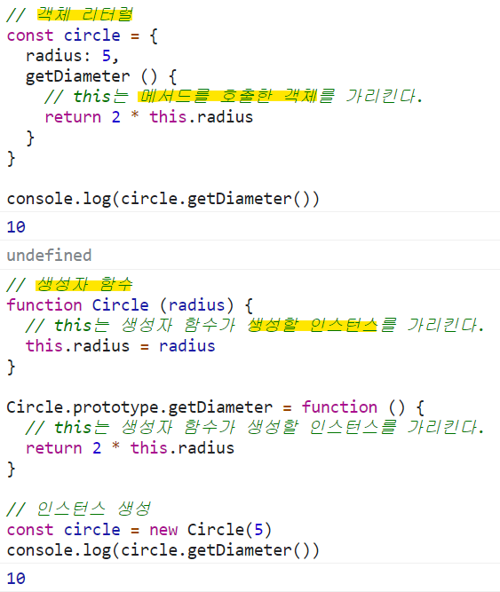

> 저자: 이웅모<br>
> 출판: 위키북스(2020)<br>
***
<details>
<summary>프로그래밍</summary>
<div markdown="1">

### 프로그래밍이란?
프로그래밍이란 컴퓨터에게 실행을 요구하는 일종의 **커뮤니케이션**이다. 이를 위해 먼저 무엇을 실행하고 싶은지 정의할 필요가 있다. 다시 말해, 프로그래밍에 앞서 해결해야 할 **문제(요구사항)를 명확히 이해한 후 적절한 문제 해결 방안을 정의**할 필요가 있다.  
이때 요구되는 것이 **문제 해결 능력**이다. 혹자는 문제 해결 능력을 알고리즘과 동일시하려는 경향이 있지만 반드시 그런 것은 아니다. 물론 문제 해결 능력을 함양하는 데 알고리즘 학습은 큰 도움이 되지만 문제 해결 능력은 더 큰 차원의 능력이다.  
대부분의 문제(요구사항)는 복잡하며 명확하지 않을 수 있다. 따라서 문제(요구사항)를 명확히 이해하는 것이 우선되어야 하며 복잡함을 단순하게 분해(decomposition)하고 자료를 정리하고 구분(modeling)해야 하며 순서에 맞게 행위를 배열해야 한다.  
즉, 프로그래밍이란 0과 1밖에 알지 못하는 기계가 실행할 수 있을 정도로 **정확하고 상세하게 요구사항을 설명**하는 작업이며, 그 결과물이 바로 코드다. 모호하고 대략적인 요구사항을 전달해도 우리의 머릿속에 있는 의도를 정확히 꿰뚫어 완벽히 이해하는 컴퓨터는 절대 존재할 수 없다.  
우리는 문제 해결 방안을 고려할 때 컴퓨터의 입장에서 문제를 바라봐야 한다. 이떄 필요한 것이 **Computational thinking(컴퓨팅 사고)**이다. 문제 해결 능력은 직감과 직관의 영역이라고 볼 수 있는데, 이는 문제를 바라보는 우리의 사고와 경험에 영향을 받는다. 사람의 일반적인 사고 방식은 매우 포괄적이며 실생활에서 경험하는 익숙한 사항에 대해 당연시하는 안이한 인식이 있다.  
예를 들어, "듣다"라는 행위를 사람은 하나의 간단하고 당연한 기능으로 생각한다. 하지만 컴퓨터에게 이 행위를 설명하는 것은 단순하지 않다. 그리고 사람은 소리의 크기를 "크다" 또는 "작다"로 표현한다. 하지만 "크다" 또는 "작다"는 의미는 상대적인 개념으로 기준이 불명확하다. 컴퓨터에게는 양적 개념인 숫자를 사용해 "현재 볼륨보다 1단계 크게 조정하라" 또는 "볼륨을 60으로 조정하라"라고 명령해야 한다.  
이처럼 컴퓨터와 사람은 사고, 인지의 방식이 다르다. 따라서 컴퓨터의 관점에서 문제를 사고해야 한다. 여기에는 논리적, 수학적 사고가 필요하며, 해결 과제를 작은 단위로 분해하고 패턴화해서 추출하며, 프로그래밍 내에서 사용될 모든 개념은 평가 가능하도록 정의해야 한다.  
### 프로그래밍 언어  
문제 해결 능력을 바탕으로 정의된 문제 해결 방안은 컴퓨터에게 전달되어야 한다. 이때 명령을 수행할 주체는 컴퓨터다. 따라서 사람이 이해할 수 있는 자연어가 아니라 컴퓨터가 이해할 수 있는 언어, 즉 기계어(machine code)로 명령을 전달해야 한다.  
하지만 사람이 기계어를 이해해서 기계어로 직접 명령을 전달하는 것은 매우 어려운 일이다. 기계어는 우리가 사용하는 언어와는 너무나도 체계가 다르기 때문이다. 심지어 비트 단위로 기술되어 있다. 다음은 x86 아키텍처의 리눅스 환경에서 그 유명한 "Hello world"를 출력하는 기계어 코드다.
```
7F 45 4C 46 01 01 01 00 00 00 ... CD 80 EB FB
```
기계어로 직접 명령을 전달하는 것을 대신할 가장 유용한 대안은 사람이 이해할 수 있는 약속된 구문(syntax, 문법)으로 구성된 "프로그래밍 언어(programming language)"를 사용해 프로그램을 작성한 후, 그것을 컴퓨터가 이해할 수 있는 기계어로 변환하는 일종의 변역기를 이용하는 것이다. 이 일종의 번역기를 **컴파일러(compiler)** 혹은 **인터프리터(interpreter)**라고 한다.  
다음은 "Hello world"를 출력하는 자바스크립트 코드다. 위의 기계어 코드보다 사람이 이해하기 쉬운, 즉 읽기 쉬운 코드다.  
```js
console.log("Hello world")
```
언어는 자신의 생각을 상대에 전달하는 방법으로 언어 공동체 내에서 이해될 수 있는 말의 집합이다. 언어는 자연어와 인공어로 구분할 수 있다.  
  
프로그래밍 언어란 컴퓨터와의 대화(명령)에 사용되는 일종의 표현 수단으로, 사람과 컴퓨터(컴파일러 또는 인터프리터) 모두가 이해할 수 있는 약속된 형태의 인공어다.  

> 프로그래밍은 프로그래밍 언어를 사용해 컴퓨터에게 실행을 요구하는 일종의 커뮤니케이션이다.  

프로그래밍 언어는 구문(syntax)과 의미(semantics)의 조합으로 표현된다.  
문법(syntax, 구문)에 맞는 문장을 구성하는 것은 물론 의미를 가지고 있어야 언어의 역할을 충실히 수행할 수 있다.  
```
Colorless green ideas sleep furiously.
```
MIT의 저명한 언어학자인 노엄 촘스키는 위 문장을 통해 언어의 의미는 문맥에 있는 것이지 문법에 있는 것이 아니라는 점을 지적했다. 위 문장은 문법적으로 전혀 문제가 없지만 의미는 없다. 프로그래밍도 마찬가지다.
```js
const number = 'string'
console.log(number * number)  // NaN
```
자바스크립트의 변수에는 어떠한 타입의 값도 할당할 수 있다. 따라서 위 예제는 문법적으로 전혀 문제가 없다. 하지만 의미적으로는 옳지 않다. number라는 이름의 변수에 문자열이 할당되어 있기 때문이다. number라는 이름의 변수에는 숫자를 할당하는 것이 의미적으로 옳다.  
결국 문제 해결 능력을 통해 만들어낸 해결 방안은 프로그래밍 언어의 문법을 사용해 표현한다. 즉, 작성한 **코드는 해결 방안의 구체적 구현물**이다. 그리고 이것은 프로그래밍 언어의 문법에 부합하는 것은 물론이고 수행하고자 하는 바를 정확히 수행하는 것, 즉 요구사항이 실현(문제가 해결)되어야 의미가 있다. **프로그래밍의 목적은 문제 해결이다.**  
대부분의 프로그래밍 언어는 "변수와 값", "키워드", "연산자", "표현식과 문", "조건문"과 "반복문"에 의한 "흐름제어(control flow)", "함수" 그리고 자료구조인 "객체", "배열" 등과 같은 문법을 제공한다.  
프로그래밍 언어가 제공하는 문법을 적절히 사용하여 변수를 통해 값을 저장하고 참조하며 연산자로 값을 연산, 평가하고 조건문과 반복문에 의한 흐름제어로 코드의 실행 순서를 제어하고 함수로 재사용 가능한 문의 집합을 만들며 객체, 배열 등으로 자료를 구조화한다.  
> 프로그래밍은 요구사항의 집합을 분석해서 적절한 자료구조와 함수의 집합으로 변환한 후, 그 흐름을 제어하는 것이다.  

<1 ~ 5쪽>

</div>
</details>
<details>
<summary>객체지향 프로그래밍 개요</summary>
<div markdown="1">

객체지향 프로그래밍은 프로그램을 명령어 또는 함수의 목록으로 보는 전통적인 명령형 프로그래밍(imperative programming)의 절차지향적 관점에서 벗어나 여러 개의 독립적 단위, 즉 **객체(object)의 집합으로 프로그램을 표현**하려는 프로그래밍 패러다임을 말한다.  
이는 실세계의 실체(사물이나 개념)를 인식하는 철학적 사고를 프로그래밍에 접목하려는 시도에서 시작한다. **실체는 특징이나 성질을 나타내는 속성(attribute/property)을 가지고 있고, 이를 통해 실체를 인식하거나 구별**할 수 있다.  
다양한 속성 중에서 프로그래밍에 필요한 속성만 간추려 내어 표현하는 것을 **추상화(abstraction)**라 한다.  
**객체지향 프로그래밍은 객체의 상태(state)를 나타내는 데이터와 상태 데이터를 조작할 수 있는 동작(behavior)을 하나의 논리적인 단위로 묶어 생각한다.  
**객체는 상태 데이터(프로퍼티)와 동작(메서드)을 하나의 논리적인 단위로 묶은 복합적인 자료구조**다.  
각 객체는 고유의 기능을 갖는 독립적인 부품으로 볼 수 있지만 자신의 고유한 기능을 수행하면서 다른 객체와 **관계성(relationship)**을 가질 수 있다. 다른 객체와 메시지를 주고받거나 데이터를 처리할 수도 있다. 또는 다른 객체의 상태 데이터나 동작을 **상속**받아 사용하기도 한다.
```js
// 상태 데이터(이름과 주소), 동작(커밋과 운동)이 하나의 단위로 구성된 객체 person
const person = {
  name: 'John',
  addresss: 'Seoul',
  makeCommit (input) {
    return `a result of ${input}`
  },
  doPullUps (numsOfRepetition) {
    return `a result of ${numsOfRepetition}`
  }
}
```
<260 ~ 261쪽>

</div>
</details>
<details>
<summary>생성자 함수에 의한 객체 생성</summary>
<div markdown="1">

## Object 생성자 함수  
new 연산자와 함께 Object 생성자 함수를 호출하면 빈 객체를 생성하여 반환한다. 빈 객체 생성 후 프로퍼티 또는 메서드를 추가하여 객체를 완성할 수 있다.
```js
// 빈 객체 생성
const person = new Object()

// 프로퍼티 추가
person.name = 'John'
person.sayHello = function () {
  console.log(`Hi! My name is ${this.name}`)
}

console.log(person)  // {name: "John", sayHello: f}
person.sayHello()  // Hi! My name is John
```
생성자 함수(constructor)란 new 연산자와 함께 호출하여 객체(인스턴스)를 생성하는 함수를 말한다. 생성자 함수에 의해 생성된 객체를 인스턴스(instance)라 한다.  
## 생성자 함수
### 객체 리터럴에 의한 객체 생성 방식의 문제점
객체 리터럴에 의한 객체 생성 방식은 직관적이고 간편하지만 단 하나의 객체만 생성한다. 따라서 동일한 프로퍼티를 갖는 객체를 여러 개 생성해야 하는 경우 매번 같은 프로퍼티를 기술해야 하기 때문에 비효율적이다.  
객체는 프로퍼티를 통해 객체 고유의 상태(state)를 표현하고, 메서드를 통해 상태 데이터인 프로퍼티를 참조하고 조작하는 동작(behavior)을 표현한다. 따라서 **프로퍼티는 객체마다 프로퍼티 값이 다를 수 있지만 메서드는 내용이 동일한 경우가 일반적**이다.  
### 생성자 함수에 의한 객체 생성 방식의 장점
생성자 함수에 의한 객체 생성 방식은 마치 객체(인스턴스)를 생성하기 위한 탬플릿(클래스)처럼 **프로퍼티 구조가 동일한 객체 여러 개를 간편하게 생성**할 수 있다.
```js
// 생성자 함수: 일반 함수와 동일한 방식으로 정의
function Circle (radius) {
  // 생성자 함수 내부의 this는 생성자 함수가 생성할 인스턴스를 가리킨다.
  this.radius = radius
  this.getDiameter = function () {
    return 2 * this.radius
  }
}

// 인스턴스의 생성: new 연산자와 함께 호출 -> 생성자 함수로 동작
const circle1 = new Circle(5)  // 반지름이 5인 Circle 객체를 생성
const circle2 = new Circle(10) // 반지름이 10인 Circle 객체를 생성

console.log(circle1.getDiameter())  // 10
console.log(circle2.getDiameter())  // 20
```
생성자 함수는 이름 그대로 객체(인스턴스)를 생성하는 함수다.  
하지만 자바와 같은 클래스 기반 객체지향언어의 생성자와는 다르게 그 형식이 정해져 있는 것이 아니라 **일반 함수와 동일한 방법으로 생성자 함수를 정의하고 new 연산자와 함꼐 호출하면 해당 함수는 생성자 함수로 동작**한다. 만약 new 연산자와 함께 생성자 함수를 호출하지 않으면 생성자 함수가 아니라 일반 함수로 동작한다.
```js
const circle3 = Circle(15)

// 일반 함수로서 호출된 Circle은 반환문이 없으므로 암묵적으로 undefined를 반환한다.
console.log(circle3)  // undefined
```  
#### this 개요
this는 객체 자신의 프로퍼티나 메서드를 참조하기 위한 자기 참조 변수(self-referencing variable)다.  
this가 가리키는 값, 즉 **this 바인딩은 함수 호출 방식에 따라 동적으로 결정**된다.
|함수 호출 방식|this가 가리키는 값(this 바인딩)|
|:----|:----|
|일반 함수로서 호출|전역 객체|
|메서드로서 호출|메서드를 호출한 객체(마침표 앞의 객체)|
|생성자 함수로서 호출|생성자 함수가 (미래에)생성할 인스턴스|
  
<234 ~ 238쪽>

</div>
</details>
<details>
<summary>상속과 프로토타입</summary>
<div markdown="1">

상속(inheritance)은 객체지향 프로그래밍의 핵심 개념으로 **어떤 객체의 프로퍼티 또는 메서드를 다른 객체가 상속받아 그대로 사용할 수 있는 것**을 말한다.  
자바스크립트는 프로토타입을 기반으로 상속을 구현하여 불필요한 중복을 제거한다. 중복을 제거하는 방법은 **기존의 코드를 적극적으로 재사용**하는 것이다.   
```js
// 생성자 함수
function Circle (radius) {
  this.radius = radius
}

// Circle 생성자 함수가 생성한 모든 인스턴스가 getArea 메서드를
// 공유해서 사용할 수 있도록 프로토타입에 추가한다
// 프로토타입은 Circle 생성자 함수의 prototype 프로퍼티에 바인딩되어 있다.
Circle.prototype.getArea = function () {
  return math.PI * this.radius ** 2
}

// 인스턴스 생성
const circle1 = new Circle(1)
const circle2 = new Circle(2)

// Circle 생성자 함수가 생성한 모든 인스턴스는 부모 객체의 역할을 하는
// 프로토타입 Circle.prototype으로부터 getArea 메서드를 상속받는다.
// 즉, Circle 생성자 함수가 생성하는 모든 인스턴스는 하나의 getArea 메서드를 공유한다.
console.log(circle1.getArea === circle2.getArea)  // true

console.log(circle1.getArea())  // 3.141592653...
console.log(circle2.getArea())  // 12.56637061...
```  
Circle 생성자 함수가 생성한 모든 인스턴스는 자신의 프로토타입, 즉 상위(부모) 객체 역할을 하는 Circle.prototype의 모든 프로퍼티와 메서드를 상속받는다.  
getArea 메서드는 단 하나만 생성되어 프로토타입인 Circle.prototype의 메서드로 할당되어 있다. 따라서 Circle 생성자 함수가 생성하는 모든 인스턴스는 getArea 메서드를 상속받아 사용할 수 있다. 즉, 자신의 상태를 나타내는 radius 프로퍼티만 개별적으로 소유하고 **내용이 동일한 메서드는 상속을 통해 공유**하여 사용하는 것이다.  
> 프로토타입은 어떤 객체의 상위(부모) 객체의 역할을 하는 객체로서 다른 객체에 공유 프로퍼티(메서드 포함)를 제공한다.   
> 프로토타입을 상속받은 하위(자식) 객체는 상위 객체의 프로퍼티를 자신의 프로퍼티처럼 자유롭게 사용할 수 있다.  

모든 객체는 [[Prototype]]이라는 내부 슬롯을 가지며, 여기에 저장되는 프로토타입은 객체 생성 방식에 의해 결정된다.  
* 객체 리터럴에 의해 생성된 객체의 프로토타입: Object.prototype  
* 생성자 함수에 의해 생성된 객체의 프로토타입: 생성자 함수의 prototype 프로퍼티에 반영되어 있는 객체  

**모든 객체는 하나의 프로토타입을 갖는다. 그리고 모든 프로토타입은 생성자 함수와 연결되어 있다.**  

<261 ~ 264쪽>
  
</div>
</details>
<details>
<summary>this</summary>
<div markdown="1">

### this 키워드
객체는 상태(state)를 나타내는 프로퍼티와 동작(behavior)을 나타내는 메서드를 하나의 논리적인 단위로 묵은 복합적인 자료구조다.  
동작을 나타내는 **메서드는 자신이 속한 객체의 상태, 즉 프로퍼티를 참조하고 변경**할 수 있어야 한다. 이때 메서드가 자신이 속한 객체의 프로퍼티를 참조하려면 먼저 **자신이 속한 객체를 가리키는 식별자를 재귀적으로 참조**할 수 있다.  
#### * 객체 리터럴 방식으로 생성한 객체 
객체 리터럴 방식으로 생성한 객체의 경우 메서드 내부에서 메서드 자신이 속한 객체를 가리키는 식별자를 재귀적으로 참조할 수 있다.  
```js
const circle = {
  // 프로퍼티: 객체 고유의 상태 데이터
  radius: 5,
  // 메서드: 상태 데이터를 참조하고 조작하는 동작
  getDiameter () {
    // 이 메서드가 자신이 속한 객체의 프로퍼티나 다른 메서드를 참조하려면
    // 자신이 속한 객체인 circle을 참조할 수 있어야 한다.
    return 2 * circle.radius
  }
}

console.log(circle.getDiameter())  // 10
```
getDiameter 메서드 내에서 메서드 자신이 속한 객체를 가리키는 식별자 circle을 참조하고 있다. 이 참조 표현식이 평가되는 시점은 getDiameter 메서드가 호출되어 함수 몸체가 실행되는 시점이다.  
위 예제의 객체 리터럴은 circle 변수에 할당되기 직전에 평가된다. 따라서 getDiameter 메서드가 호출되는 시점에는 이미 객체 리터럴의 평가가 완료되어 객체가 생성되었고, circle 식별자에 생성된 객체가 할당된 이후다. 따라서 메서드 내부에서 circle 식별자를 참조할 수 있다.  
#### * 생성자 함수 방식으로 생성한 객체
```js
function Circle (radius) {
  // 이 시점에는 생성자 함수 자신이 생성할 인스턴스를 가리키는 식별자를 알 수 없다.
  ????.radius = radius
}

Circle.prototype.getDiameter = function () {
  // 이 시점에는 생성자 함수 자신이 생성할 인스턴스를 가리키는 식별자를 알 수 없다.
  return 2 * ????.radius
}

// 생성자 함수로 인스턴스를 생성하려면 먼저 생성자 함수를 정의해야 한다.
const circle = new Circle(5)
```
생성자 함수 내부에서는 프로퍼티 또는 메서드를 추가하기 위해 자신이 생성할 인스턴스를 참조할 수 있어야한다.  
하지만 생성자 함수에 의한 객체 생성 방식은 먼저 생성자 함수를 정의한 이후 new 연산자와 함꼐 생성자 함수를 호출하는 단계가 추가로 필요하다. 다시 말해, 생성자 함수로 인스턴스를 생성하려면 먼저 생성자 함수가 존재해야 한다.  
생성자 함수를 정의하는 시점에는 아직 인스턴스를 생성하기 이전이므로 생성자 함수가 생성할 인스턴스를 가리키는 식별자를 알 수 없다. 따라서 자신이 속한 객체 또는 자신이 생성할 인스턴스를 가리키는 특수한 식별자가 필요하다. 이를 위해 자바스크립트는 this라는 특수한 식별자를 제공한다.  
**this는 자신이 속한 객체 또는 자신이 생성할 인스턴스를 가리키는 자기 참조 변수(self-referencing variable)**다. this를 통해 자신이 속한 객체 또는 자신이 생성할 인스턴스의 프로퍼티나 메서드를 참조할 수 있다.  
this는 자바스크립트 엔진에 의해 암묵적으로 생성되며, 코드 어디서든 참조할 수 있다. **함수를 호출하면 arguments 객체와 this가 암묵적으로 함수 내부에 전달**된다. 함수 내부에서 arguments 객체를 지역 변수처럼 사용할 수 있는 것처럼 this도 지역 변수처럼 사용할 수 있다. 단, this가 가리키는 값, 즉 **this 바인딩은 함수 호출 방식에 의해 동적으로 결정**된다.  
> this 바인딩(binding)
> 바인딩이랑 식별자와 값을 연결하는 과정이다. 예를 들어 변수 선언은 변수 이름(식별자)과 확보된 메모리 공간의 주소를 바인딩하는 것이다. this 바인딩은 this(키워드로 분류되지만 식별자 역할을 한다)와 this가 가리킬 객체를 바인딩하는 것이다.  
  
  

자바나 C++ 같은 클래스 기반 언어에서 this는 언제나 클래스가 생성하는 인스턴스를 가리킨다. 하지만 **자바스크립트의 this는 함수가 호출되는 방식에 따라 this에 바인딩될 값, 즉 this 바인딩이 동적으로 결정**된다.  
this는 코드 어디에서든 참조 가능하다. 전역에서도 함수 내부에서도 참조할 수 있다.  

<342 ~ 345쪽>

</div>
</details>