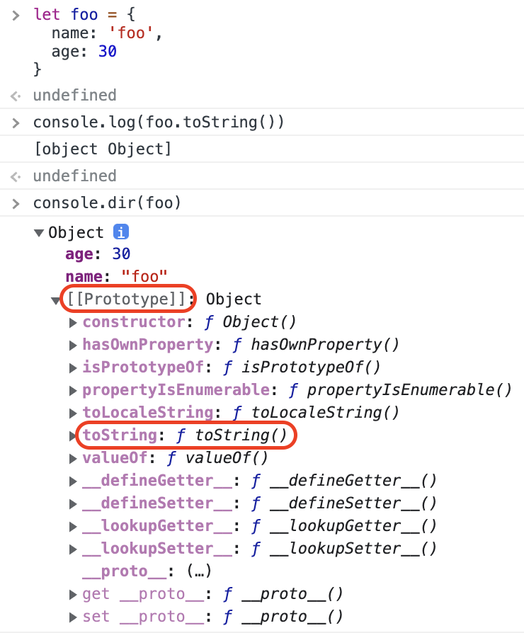
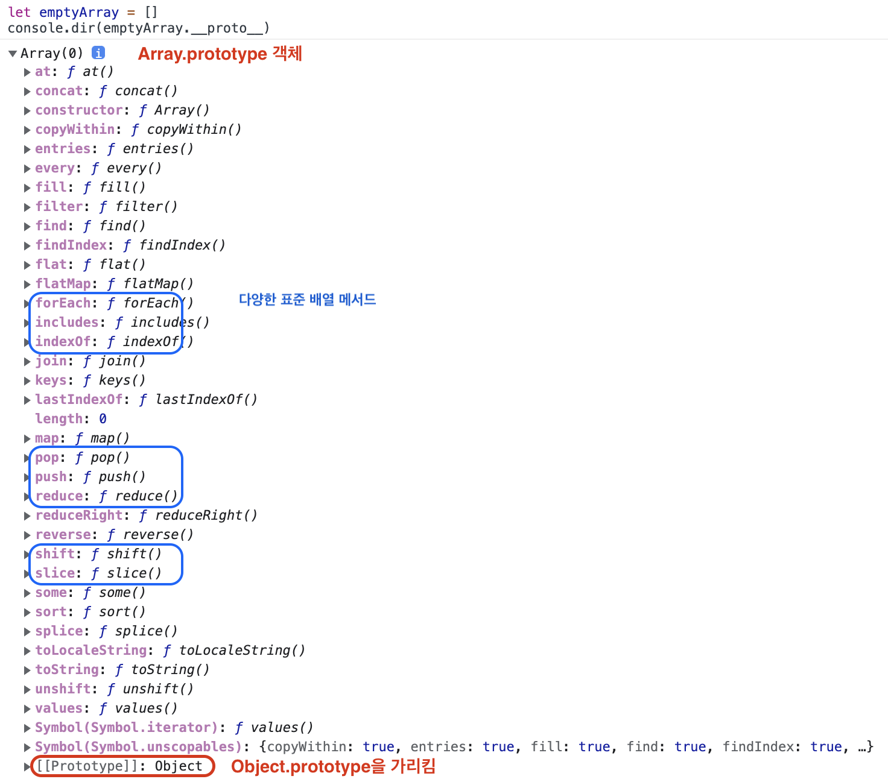
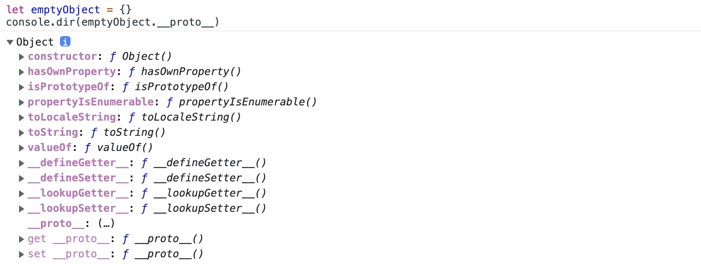

> 저자: 송형주, 고현준 
> 출판: 한빛미디어(2014)
***

프로토타입 개요

<b>자바스크립트의 모든 객체는 자신의 부모 역할을 하는 객체와 연결되어 있다.</b> 이것은 마치 객체지향의 상속 개념과 같이 부모 객체의 프로퍼티를 마치 자신의 것처럼 쓸 수 있는 것 같은 특징이 있다. 자바스크립트에서는 이러한 <b>부모 객체를 프로토타입 객체(짧게는 프로토타입)</b>라고 부른다. 
 
객체 리터럴 방식으로 foo 객체를 생성하고, 이 객체의 toString() 메서드를 출력할 경우 해당 객체에는 toString() 메서드가 없으므로 에러가 발생해야 하지만 정상적으로 결과가 출력된 것을 확인할 수 있다.  
<pre>
<code>
console.log(foo.toString())  // object Object
</code>
</pre>
foo 객체의 프로토타입에 toString() 메서드가 이미 정의되어 있고, foo 객체가 상속처럼 해당 메서드를 호출했기 때문이다. 
객체 리터럴로 생성한 name과 age 프로퍼티 이외에도 foo 객체에 [[Prototype]] 프로퍼티가 있다는 것을 확인할 수 있다. 이 프로퍼티가 바로 foo 객체의 부모인 프로토타입 객체를 가리킨다. 
ECMAScript 명세서에는 <b>자바스크립트의 모든 객체는 자신의 프로토타입을 가리키는 [[Prototype]] 이라는 숨겨진 프로퍼티를 가진다</b>고 설명하고 있다. 즉, foo 객체는 자신의 부모 객체를 [[Prototype]] 이라는 내부 프로퍼티로 연결하고 있는 것이다.    
<b>모든 객체의 프로토타입은 자바스크립트의 룰에 따라 객체를 생성할 때 결정</b>된다.   
객체 리터럴 방식으로 생성된 객체의 경우 Object.prototype 객체가 프로토타입 객체가 된다. 이 객체에 toString(), valueOf() 등과 같은 모든 객체에서 호출 가능한 자바스크립트 기본 내장 메서드가 포함되어 있다. 그 결과 foo 객체는 foo.toString()과 같이 <u>자신의 프로토타입인 Object.prototype 객체에 포함된 다양한 메서드를 마치 자신의 프로퍼티인 것처럼 상속받아 사용</u>할 수 있다. 
또한, 객체를 생성할 때 결정된 프로토타입 객체는 임의의 다른 객체로 변경하는 것도 가능하다. 즉, 부모 객체를 동적으로 바꿀 수도 있는 것이다. 자바스크립트에서는 이러한 특징을 활용해서 객체 상속의 기능을 구현한다. 
- 49 ~ 52쪽

 

배열의 프로토타입과 객체의 프로토타입 비교

객체 리터럴 방식으로 생성한 객체의 경우, 객체 표준 메서드를 저장하고 있는 Object.prototype 객체가 프로토타입이다. 반면에 배열의 경우 Array.prototype 객체가 부모 객체인 프로토타입이 된다.  Array.prototype 객체는 배열에서 사용할 push(), pop() 같은 표준 메서드를 포함하고 있다. 그리고 <b>Array.prototype 객체의 프로토타입은 Object.prototype 객체</b>가 된다.
객체는 자신의 프로토타입이 가지는 모든 프로퍼티 및 메서드를 상속받아 사용할 수 있다고 했으므로, <u>배열은 Array.prototype에 포함된 배열 표준 메서드와 Object.prototype의 표준 메서드들을 모두 사용</u>할 수 있다. 
 
emptyArray 배열의 프로토타입을 나타내는 emptyArray.__proto__는 Array(0) 객체를 가리키는데 이것이 바로 Array.prototype 객체를 나타낸다. 자세히 보면 이 객체 내에 push() 메서드를 비롯한 다양한 자바스크립트의 표준 메서드가 있다는 것을 확인할 수 있다. 그리고 Array.prototype 객체 역시 __proto__ 프로퍼티가 있다는 것을 알 수 있으며, 이 값은 Object.prototype을 가리킨다. 
 
반면에 emptyObject는 일반 객체이므로, 그것의 프로토타입인 __prototype__ 프로퍼티가 Object.prototype을 가리키고 있다는 것을 확인할 수 있다. 
- 59 ~ 60쪽

 

