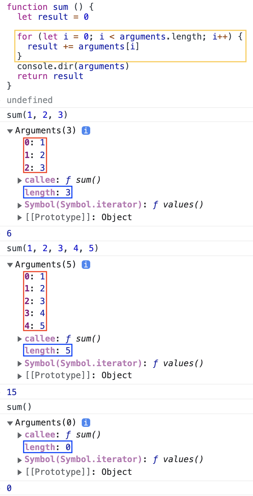

함수의 기본적인 기능은 당연히 함수를 호출하여 코드를 실행하는 것이다. 하지만 자바스크립트 언어 자체가 C/C++ 같은 엄격한 문법 체크를 하지 않는 자유로운 특성의 언어이므로 함수 호출 또한 다른 언어와는 달리 자유롭다.  

# arguments 객체
C와 같은 엄격한 언어와 달리, 자바스크립트에서는 함수를 호출할 때 함수 형식에 맞춰 인자를 넘기지 않더라도 에러가 발생하지 않는다.  
정의된 함수의 인자보다 적게 함수를 호출했을 경우, 넘겨지지 않은 인자에는 **undefined** 값이 할당된다. 이와 반대로 정의된 인자 개수보다 많게 함수를 호출했을 경우는 에러가 발생하지 않고, 초과된 인수는 무시된다.  

이를 가능케 하는 게 바로 **arguments 객체**다. 자바스크립트에서는 함수를 호출할 때 인수들과 함께 암묵적으로 arguments 객체가 함수 내부로 전달되기 때문이다. arguments 객체는 **함수를 호출할 때 넘긴 인자들이 배열 형태로 저장된 객체**를 의미한다. 특이한 점은 이 객체는 실제 배열이 아닌 **유사 배열 객체**라는 점이다. 

  

arguments 객체는 매개변수 개수가 정확하게 정해지지 않은 함수를 구현하거나, 전달된 인자의 개수에 따라 서로 다른 처리를 해줘야 하는 함수를 개발하는 데 유용하게 사용할 수 있다.  
arguments 객체를 사용할 경우 함수가 호출될 당시의 인자들에 배열 형태로 접근할 수 있다.