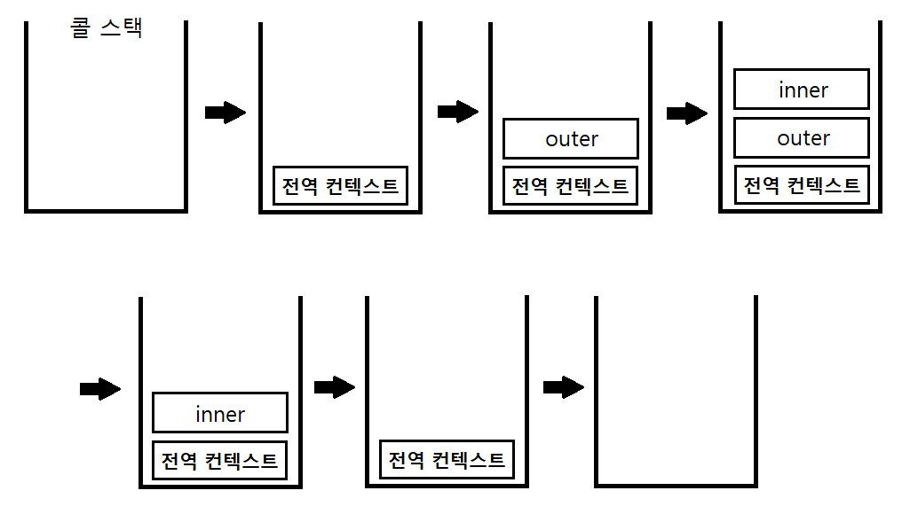

실행 컨텍스트(execution context)는 **실행할 코드에 제공할 환경 정보들을 모아놓은 객체**로, 자바스크립트의 **동적 언어**로서의 성격을 가장 잘 파악할 수 있는 개념이다. 자바스크립트는 어떤 실행 컨텍스트가 활성화되는 시점에 선언된 변수를 위로 끌어올리고(호이스팅), 외부 환경 정보를 구성하고, this 값을 설정하는 등의 동작을 수행하는데, 이로 인해 다른 언어에서는 발견할 수 없는 특이한 현상들이 발생한다.  
실행 컨텍스트는 자바스크립트에서 가장 중요한 핵심 개념 중 하나로서 **클로저**를 지원하는 대부분의 언어에서 이와 유사하거나 동일한 개념이 적용되어 있다.

## 실행 컨텍스트란?
동일한 환경에 있는 코드들을 실행할 때 필요한 환경 정보들을 모아 컨텍스트를 구성하고, 이를 콜 스택(call stack)에 쌓아올렸다가, 가장 위에 쌓여있는 컨텍스트와 관련 있는 코드들을 실행하는 식으로 전체 코드의 환경과 순서를 보장한다.  
여기서 '동일한 환경', 즉 하나의 실행 컨텍스트를 구성할 수 있는 방법으로 전역공간, eval() 함수, 함수 등이 있다. 자동으로 생성되는 전역공간과 eval을 제외하면 우리가 흔히 실행 컨텍스트를 구성하는 방법은 함수를 실행하는 것뿐이다(ES6에서는 블록{}에 의해서도 새로운 실행 컨텍스트가 생성된다).  

* 실행 컨텍스트와 콜 스택

```js
// -------------------- (1)
var a = 1
function outer () {
  function inner () {
    console.log(a)  // undefined
    var a = 3
  }
  inner()  // --------- (2)
  console.log(a)  // 1
}
outer()  // ----------- (3)
console.log(a)  // 1
```

* 실행 컨텍스트와 콜 스택  
  
    

처음 자바스크립트 코드를 실행하는 순간(1) **전역 컨텍스트**가 콜 스택에 담긴다. 전역 컨텍스트라는 개념은 일반적인 실행 컨텍스트와 크게 다를 것이 없다(굳이 차이점을 찾아면 전역 컨텍스트가 관여하는 대상은 함수가 아닌 전역 공간이기 때문에 arguments가 없다. 전역 공간을 둘러싼 외부 스코프란 존재할 수 없기 때문에 스코프체인 상에는 전역 스코프 하나만 존재한다). **최상단의 공간은 코드 내부에서 별도의 실행 명령이 없어도 브라우저에서 자동으로 실행**하므로 **자바스크립트 파일이 열리는 순간 전역 컨텍스트가 활성화** 된다고 이해하면 된다.  

콜 스택에는 전역 컨텍스트 외에 다른 덩어리가 없으므로 전역 컨텍스트와 관련된 코드들을 순차로 진행하다가 (3)에서 outer 함수를 호출하면 자바스크립트 엔진은 outer 에 대한 환경 정보를 수집해서 outer 실행 컨텍스트를 생성한 후 콜 스택에 담는다. 콜 스택 맨 위에 outer 실행 컨텍스트가 놓인 상태가 됐으므로 전역 컨텍스트와 관련된 코드의 실행을 일시중단하고 outer 실행 컨텍스트와 관련된 코드, 즉 outer 함수 내부의 코드들을 순차적으로 실행한다.  

다시 (2)에서 inner 함수의 실행 컨텍스트가 콜 스택의 가장 위에 담기면 outer 컨텍스트와 관련된 코드의 실행을 중단하고 inner 함수 내부의 코드를 순서대로 진행한다. inner 함수 내부에서 a 변수에 값 3을 할당하고 나면, inner 함수의 실행이 종료되면서 inner 실행 컨텍스트가 콜 스택에서 제거된다. 그러면 아래에 있던 outer 컨텍스트가 콜 스택의 맨 위에 존재하게 되므로 중단했던 (2)의 다음 줄부터 이어서 실행한다.  

a 변수의 값을 출력하고 나면 outer 함수의 실행이 종료되어 outer 실행 컨텍스트가 콜 스택에서 제거되고, 콜 스택에는 전역 컨텍스트만 남아 있게 된다. 그런 다음, 실행을 중단했던 (3)의 다음 줄부터 이어서 실행한다. a 변수의 값을 출력하고 나면 전역 공간에 더는 실행할 코드가 남아 있지 않아 전역 컨텍스트도 제거되고, 콜 스택에는 아무것도 남지 않은 상태로 종료된다.  

스택 구조를 잘 생각해보면 한 **실행 컨텍스트가 콜 스택의 맨 위에 쌓이는 순간이 곧 현재 실행할 코드에 관여하게 되는 시점**임을 알 수 있다. 기존의 컨텍스트는 새로 쌓인 컨텍스트보다 아래에 위치할 수 밖에 없기 때문이다. 이렇게 어떤 실행 컨텍스트가 활성화될 때 자바스크립트 엔진은 해당 컨텍스트에 관련된 코드들을 실행하는 데 필요한 환경 정보들을 수집해서 실행 컨텍스트 객체에 저장한다. 이 객체는 자바스크립트 엔진이 활용할 목적으로 생성할 뿐 개발자가 코드를 통해 확인할 수는 없다.  

* 활성화된 실행 컨텍스트의 수집 정보
  + VariableEnvironment
  현재 컨텍스트 내의 식별자들에 대한 정보 + 외부 환경 정보  
  (**선언 시점의 LexicalEnvironment의 스냅샷**으로 변경 사항은 반영되지 않음)
  + LexicalEnvironment: 처음에는 VariableEnvironment와 같지만 변경 사항이 실시간으로 반영됨
  + ThisBinding: this 식별자가 바라봐야 할 대상 객체
  

